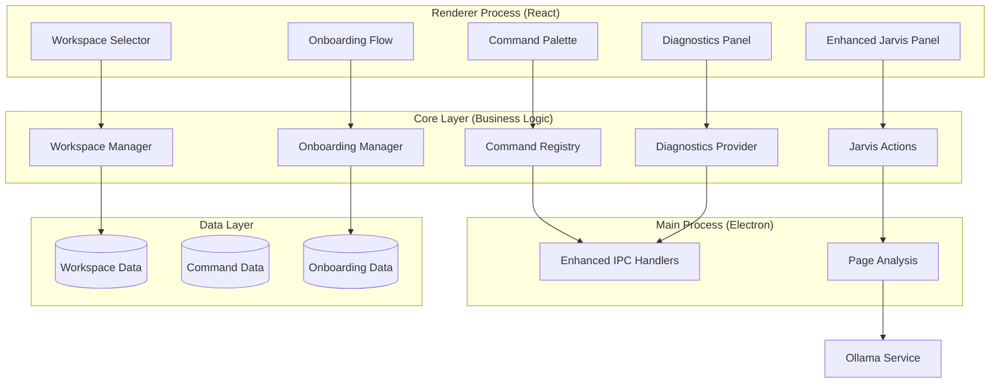

# Design Document: Arc Browser MVP Enhancements

## Overview

This design document outlines the implementation strategy for Arc Browser MVP enhancements that transform the stable v1.2.0 browser into a polished product. The enhancements include a command palette for power users, enhanced Jarvis page analysis capabilities, lightweight workspaces, user-friendly diagnostics, and first-run onboarding. The design prioritizes seamless integration with existing architecture, maintaining performance, and following established patterns.

## Architecture

### High-Level Architecture



## Components and Interfaces

### 1. Command Palette System

#### Command Registry Interface
```typescript
export type CommandId = 
  | 'tab:new'
  | 'tab:switch-next'
  | 'tab:switch-prev'
  | 'tab:close'
  | 'jarvis:focus'
  | 'jarvis:analyze-page'
  | 'jarvis:summarize-page'
  | 'jarvis:explain-page'
  | 'history:search'
  | 'session:restore'
  | 'settings:open'
  | 'workspace:save'
  | 'workspace:switch'
  | 'workspace:delete'
  | 'diagnostics:open'
  | 'demo:open-workspace';

export interface Command {
  id: CommandId;
  title: string;
  description?: string;
  category: 'tab' | 'jarvis' | 'workspace' | 'system';
  keywords?: string[];
  run(): void | Promise<void>;
}

export interface CommandRegistry {
  getAllCommands(): Command[];
  findCommands(query: string): Command[];
  registerCommand(command: Command): void;
  unregisterCommand(id: CommandId): void;
  executeCommand(id: CommandId): Promise<void>;
}
```

#### Command Palette Component
```typescript
export interface CommandPaletteProps {
  isOpen: boolean;
  onClose: () => void;
}

export interface CommandPaletteState {
  query: string;
  selectedIndex: number;
  filteredCommands: Command[];
}
```

### 2. Enhanced Jarvis Page Analysis

#### Page Analysis Interface
```typescript
export interface PageContent {
  text: string;
  url: string;
  title: string;
  truncated: boolean;
  extractedAt: number;
}

export interface JarvisAction {
  id: string;
  title: string;
  description: string;
  icon: string;
  execute(content: PageContent): Promise<JarvisChatMessage[]>;
}

export interface JarvisActions {
  analyzeCurrentPage(): Promise<JarvisChatMessage[]>;
  summarizeCurrentPage(): Promise<JarvisChatMessage[]>;
  explainCurrentPageSimply(): Promise<JarvisChatMessage[]>;
  getCurrentPageContent(): Promise<PageContent | null>;
}
```

#### IPC Extensions for Page Analysis
```typescript
// Main process handlers
ipcMain.handle('arc:getCurrentPageText', async () => {
  const contents = getActiveWebContents();
  if (!contents) return { ok: false, error: 'No active tab' };
  
  const text = await contents.executeJavaScript(`
    document.body ? document.body.innerText.slice(0, 8000) : ''
  `);
  
  return { ok: true, text, url: contents.getURL(), title: contents.getTitle() };
});
```

### 3. Lightweight Workspaces System

#### Workspace Data Model
```typescript
export interface Workspace {
  id: string;
  name: string;
  createdAt: number;
  updatedAt: number;
  sessionSnapshot: SavedSession;
  description?: string;
  tags?: string[];
}

export interface WorkspaceManager {
  listWorkspaces(): Promise<Workspace[]>;
  saveWorkspaceFromCurrentSession(name: string, description?: string): Promise<Workspace>;
  loadWorkspace(id: string): Promise<SavedSession | null>;
  deleteWorkspace(id: string): Promise<void>;
  updateWorkspace(id: string, updates: Partial<Workspace>): Promise<Workspace>;
}
```

#### Workspace Storage
- **Format**: JSON file at `data/workspaces.json`
- **Structure**: Array of workspace objects with metadata
- **Backup**: Automatic backup on modification
- **Migration**: Version-aware loading for future compatibility

```typescript
export interface WorkspaceStorage {
  version: string;
  workspaces: Workspace[];
  lastModified: number;
}
```

### 4. User-Friendly Diagnostics Panel

#### Diagnostics Data Model
```typescript
export interface DiagnosticsSnapshot {
  timestamp: number;
  ollama: {
    available: boolean;
    model?: string;
    endpoint: string;
    lastError?: string;
    status: 'connected' | 'disconnected' | 'error';
  };
  database: {
    connected: boolean;
    path: string;
    lastOperation?: number;
    lastError?: string;
    status: 'connected' | 'error';
  };
  session: {
    tabs: number;
    workspaces: number;
    lastSavedAt?: number;
    autoSaveEnabled: boolean;
  };
  jarvis: {
    enabled: boolean;
    recommendationsLoaded: boolean;
    lastRecommendationAt?: number;
    cacheSize: number;
  };
  app: {
    version: string;
    platform: string;
    environment: 'development' | 'production';
    uptime: number;
  };
}

export interface DiagnosticsProvider {
  getDiagnosticsSnapshot(): Promise<DiagnosticsSnapshot>;
  runHealthCheck(): Promise<{ healthy: boolean; issues: string[] }>;
}
```

### 5. First-Run Onboarding System

#### Onboarding Data Model
```typescript
export interface OnboardingState {
  hasSeenOnboarding: boolean;
  completedSteps: string[];
  skippedAt?: number;
  completedAt?: number;
  version: string;
}

export interface OnboardingStep {
  id: string;
  title: string;
  description: string;
  icon: string;
  action?: () => void;
}

export interface OnboardingManager {
  isFirstRun(): Promise<boolean>;
  getOnboardingSteps(): OnboardingStep[];
  markStepCompleted(stepId: string): Promise<void>;
  markOnboardingCompleted(): Promise<void>;
  skipOnboarding(): Promise<void>;
  createDemoWorkspace(): Promise<Workspace>;
}
```

#### Demo Workspace Configuration
```typescript
export const DEMO_WORKSPACE_TABS = [
  {
    url: 'https://github.com/arc-browser/arc-browser',
    title: 'Arc Browser - GitHub',
    description: 'Learn about Arc Browser development'
  },
  {
    url: 'https://developer.mozilla.org/en-US/docs/Web/API',
    title: 'Web APIs - MDN',
    description: 'Explore web development resources'
  },
  {
    url: 'https://www.theverge.com/tech',
    title: 'The Verge - Technology',
    description: 'Stay updated with tech news'
  }
];
```

## Data Models

### Enhanced Settings Model
```typescript
export interface ArcSettings {
  // Existing settings...
  theme: 'system' | 'light' | 'dark';
  jarvisEnabled: boolean;
  useHistoryForRecommendations: boolean;
  incognitoEnabled: boolean;
  
  // New MVP settings
  commandPaletteEnabled: boolean;
  workspacesEnabled: boolean;
  onboardingCompleted: boolean;
  onboardingVersion: string;
  diagnosticsEnabled: boolean;
  pageAnalysisEnabled: boolean;
  demoWorkspaceCreated: boolean;
}
```

### Command Serialization Model
```typescript
export interface SerializableCommand {
  id: CommandId;
  title: string;
  description?: string;
  category: string;
  keywords?: string[];
  enabled: boolean;
  customized: boolean;
}

export interface CommandRegistryData {
  version: string;
  commands: SerializableCommand[];
  customCommands: SerializableCommand[];
  lastModified: number;
}
```

## Correctness Properties

A property is a characteristic or behavior that should hold true across all valid executions of a system—essentially, a formal statement about what the system should do. Properties serve as the bridge between human-readable specifications and machine-verifiable correctness guarantees.

### Property 1: Command Palette Keyboard Consistency
**For any** keyboard event with Ctrl+K (or Cmd+K on macOS), the command palette should open consistently regardless of current application state.
**Validates: Requirements 1.1**

### Property 2: Command Search Filtering Accuracy
**For any** search query in the command palette, all returned commands should match the query in either title, description, or keywords.
**Validates: Requirements 1.3**

### Property 3: Command Execution Completeness
**For any** valid command selection, the command should execute successfully and the palette should close.
**Validates: Requirements 1.4**

### Property 4: Page Content Extraction Bounds
**For any** page content extraction request, the returned text should not exceed 8000 characters.
**Validates: Requirements 2.5**

### Property 5: Jarvis Analysis Integration
**For any** page analysis action, the results should appear in the Jarvis chat interface as properly formatted messages.
**Validates: Requirements 2.7**

### Property 6: Workspace Session Capture Completeness
**For any** workspace save operation, all open tabs, their URLs, and tab group organization should be captured in the workspace data.
**Validates: Requirements 3.1**

### Property 7: Workspace Persistence Integrity
**For any** workspace saved to storage, the workspace should be retrievable with all original data intact after application restart.
**Validates: Requirements 3.6**

### Property 8: Workspace Restoration Accuracy
**For any** workspace restoration, the current tabs should be replaced with exactly the tabs from the workspace snapshot.
**Validates: Requirements 3.3**

### Property 9: Workspace Serialization Round-Trip
**For any** valid workspace object, serializing then parsing should produce an equivalent workspace object.
**Validates: Requirements 7.5**

### Property 10: Command Registry Serialization Round-Trip
**For any** valid command definition, serializing then parsing should produce an equivalent command object.
**Validates: Requirements 8.4**

### Property 11: Keyboard Shortcut Conflict Prevention
**For any** new keyboard shortcut registration, it should not conflict with existing shortcuts on the same platform.
**Validates: Requirements 6.7**

### Property 12: Diagnostics Data Completeness
**For any** diagnostics snapshot request, all required system status fields (Ollama, database, session, Jarvis, app) should be present and populated.
**Validates: Requirements 4.1**

### Property 13: First-Run Detection Accuracy
**For any** fresh application installation, the first-run detection should trigger onboarding exactly once.
**Validates: Requirements 5.1, 5.8**

### Property 14: Error Handling Resilience
**For any** parsing error in workspace or command data, the system should handle the error gracefully without breaking core functionality.
**Validates: Requirements 7.4, 8.5**

## Error Handling

### Command Palette Errors
- **Command Execution Failure**: Log error, show user notification, keep palette open
- **Search Performance**: Debounce search input, limit results to prevent UI lag
- **Keyboard Conflict**: Warn on registration, allow user to resolve conflicts

### Page Analysis Errors
- **No Active Tab**: Show user-friendly message "No page to analyze"
- **Content Extraction Failure**: Fallback to page title and URL analysis
- **Ollama Unavailable**: Show clear message with setup instructions
- **Analysis Timeout**: Cancel request after 30 seconds, show timeout message

### Workspace Errors
- **Save Failure**: Retry with exponential backoff, show error dialog
- **Load Failure**: Show error message, offer to delete corrupted workspace
- **Storage Full**: Show disk space warning, offer cleanup options
- **Invalid Data**: Validate and sanitize, show migration options

### Diagnostics Errors
- **Service Unavailable**: Show "Unknown" status instead of crashing
- **Permission Denied**: Show appropriate access error messages
- **Data Collection Failure**: Show partial results with warnings

### Onboarding Errors
- **Demo Workspace Creation Failure**: Continue onboarding, log error
- **Settings Persistence Failure**: Retry save, warn user if persistent
- **Step Navigation Failure**: Allow manual step completion

## Testing Strategy

### Unit Testing Approach
- Test each module in isolation with mocked dependencies
- Focus on business logic and data transformations
- Cover happy paths, edge cases, and error conditions
- Use descriptive test names that explain the scenario

### Property-Based Testing Approach
- Validate universal properties across 100+ generated inputs
- Use generators that create realistic test data
- Test invariants, round-trips, and consistency properties
- Each property test references a design property number

### Integration Testing Approach
- Test IPC communication for new handlers
- Verify component interactions and state management
- Test complete user workflows end-to-end
- Use realistic data scenarios and user interactions

### Component Testing Approach
- Test React components with realistic props and state
- Verify keyboard interactions and accessibility
- Test responsive behavior and error states
- Mock external dependencies and services

### Test Organization
```
src/
├── core/
│   ├── commandRegistry.ts
│   ├── commandRegistry.test.ts
│   ├── commandRegistry.pbt.test.ts
│   ├── jarvisActions.ts
│   ├── jarvisActions.test.ts
│   ├── workspaceManager.ts
│   ├── workspaceManager.test.ts
│   ├── workspaceManager.pbt.test.ts
│   └── diagnosticsProvider.ts
├── renderer/
│   ├── components/
│   │   ├── CommandPalette.tsx
│   │   ├── CommandPalette.test.tsx
│   │   ├── DiagnosticsPanel.tsx
│   │   ├── DiagnosticsPanel.test.tsx
│   │   └── OnboardingFlow.tsx
│   └── hooks/
│       ├── useCommandPalette.ts
│       └── useCommandPalette.test.ts
└── test/
    ├── fixtures/
    │   ├── workspaces.json
    │   ├── commands.json
    │   └── diagnostics.json
    └── integration/
        ├── commandPalette.test.ts
        ├── workspaceFlow.test.ts
        └── onboarding.test.ts
```

### Test Configuration
- **Framework**: Vitest for unit and integration tests
- **Property Testing**: fast-check for property-based tests
- **Component Testing**: React Testing Library
- **E2E Testing**: Playwright for critical user flows
- **Coverage Target**: 85%+ for new modules
- **Minimum Iterations**: 100 per property test

### Performance Testing
- **Command Palette**: Search response time < 50ms for 1000+ commands
- **Workspace Operations**: Save/load time < 500ms for 50+ tabs
- **Page Analysis**: Content extraction < 200ms for typical pages
- **Diagnostics**: Status collection < 100ms for all services
- **Memory Usage**: No memory leaks during extended usage

## Implementation Phases

### Phase 1: Command Palette Foundation
1. Create command registry core module
2. Implement basic command palette UI component
3. Add keyboard shortcut integration (Ctrl+K/Cmd+K)
4. Wire basic commands (tabs, settings, Jarvis)

### Phase 2: Enhanced Jarvis Capabilities
1. Implement page content extraction IPC handler
2. Create Jarvis action modules (analyze, summarize, explain)
3. Integrate actions with existing Jarvis panel
4. Add page analysis buttons to Jarvis UI

### Phase 3: Workspace System
1. Create workspace data model and storage
2. Implement workspace manager core module
3. Add workspace commands to command palette
4. Create workspace selection UI components

### Phase 4: Diagnostics and Onboarding
1. Implement diagnostics provider and panel
2. Create onboarding flow components
3. Add demo workspace creation
4. Integrate all features with command palette

### Phase 5: Integration and Polish
1. Add comprehensive error handling
2. Implement property-based tests
3. Performance optimization and testing
4. Documentation and user guides

## Security Considerations

### Page Content Extraction
- Limit content extraction to 8000 characters
- Sanitize extracted content before sending to Ollama
- Respect incognito mode (no analysis in private tabs)
- No extraction from sensitive domains (banking, etc.)

### Workspace Data
- Validate workspace data structure before loading
- Sanitize workspace names and descriptions
- Limit workspace storage size to prevent disk exhaustion
- No sensitive data in workspace metadata

### Command Execution
- Validate command IDs before execution
- Prevent command injection through search queries
- Rate limit command execution to prevent abuse
- Log command execution for debugging

### Diagnostics Information
- Only expose non-sensitive system information
- No file paths or personal data in diagnostics
- Sanitize error messages before display
- Optional diagnostics data collection

## Accessibility Considerations

### Command Palette
- Full keyboard navigation support
- Screen reader announcements for search results
- High contrast mode compatibility
- Focus management and restoration

### Diagnostics Panel
- Clear status indicators with text and icons
- Descriptive error messages in plain language
- Keyboard accessible controls
- Proper ARIA labels and roles

### Onboarding Flow
- Skip links for experienced users
- Keyboard navigation between steps
- Clear progress indicators
- Alternative text for all images and icons

## Performance Optimization

### Command Search
- Debounced search input (300ms delay)
- Fuzzy search with relevance scoring
- Result caching for repeated queries
- Lazy loading of command descriptions

### Workspace Operations
- Incremental workspace saving
- Compressed workspace storage
- Background workspace loading
- Optimistic UI updates

### Page Analysis
- Content extraction caching (5 minutes)
- Streaming analysis results
- Background Ollama connection pooling
- Request cancellation on navigation

### Memory Management
- Cleanup event listeners on component unmount
- Dispose of large objects after use
- Limit workspace history retention
- Garbage collection hints for large operations