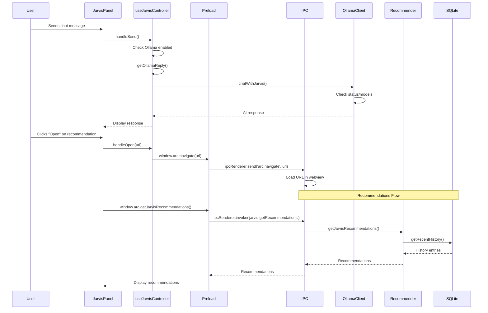
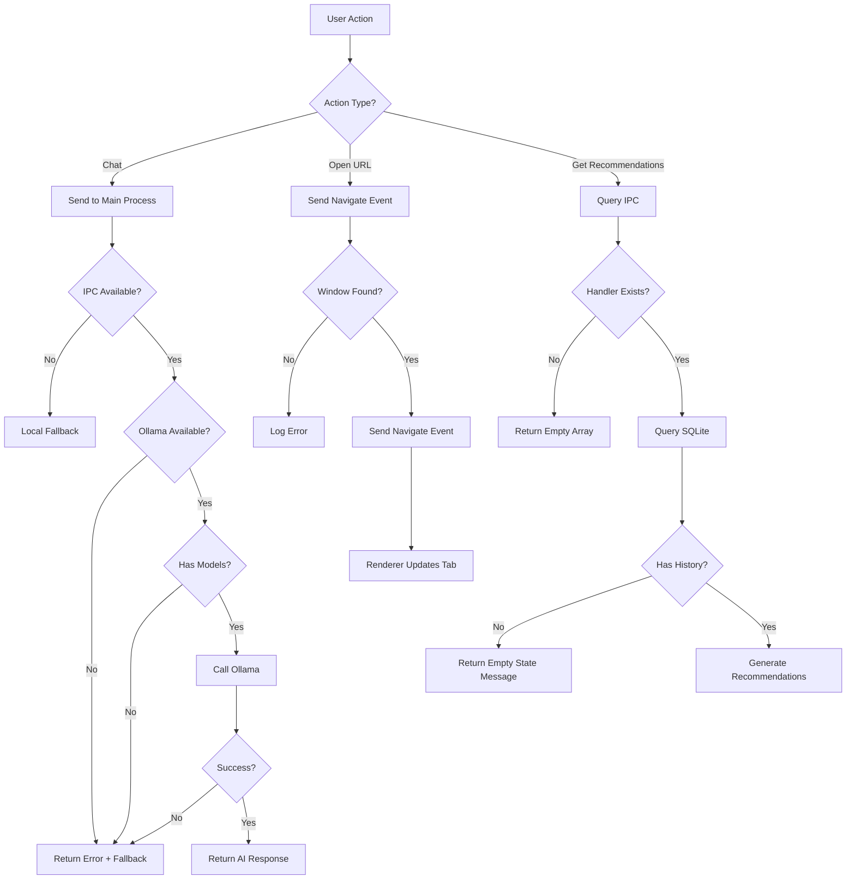

# Design Document: Jarvis Integration Fix

## Overview

This design addresses critical integration issues in the Arc Browser's Jarvis AI assistant. Currently, Jarvis chat only returns fallback messages instead of calling Ollama, recommendations may not be using actual SQLite history data, and the "Open" button on recommendation cards does not navigate to URLs. This design provides a systematic fix for the complete integration chain from UI to backend services.

## Architecture

### Current State Analysis

**What's Working:**
- JarvisPanel UI renders correctly
- useJarvisController hook has Ollama integration logic
- OllamaClient has proper error handling and status checking
- Recommender uses SQLite history via historyStoreMain
- IPC handlers exist for recommendations and history

**What's Broken:**
1. **Missing `jarvis:chat` IPC handler** - Chat messages cannot reach the main process
2. **Navigate handler is commented out** - URL navigation doesn't work
3. **Potential history recording issues** - Need to verify page load events are firing

### Component Interaction Flow



## Components and Interfaces

### 1. IPC Handler Additions

**File:** `src/main/ipc.ts`

**Missing Handler to Add:**

```typescript
// Add this handler to setupIpc function
ipcMain.handle('jarvis:chat', async (_event, messages: Array<{from: string; text: string}>) => {
    try {
        console.log('🤖 Jarvis chat request received:', messages.length, 'messages');
        
        // Get settings to check if Ollama is enabled
        const settings = await getSettings();
        
        if (!settings.ollamaEnabled) {
            console.log('📝 Ollama disabled, returning fallback indicator');
            return {
                ok: true,
                reply: null, // Null indicates fallback should be used
                useFallback: true
            };
        }
        
        // Get Ollama endpoint and model from settings
        const ollamaEndpoint = settings.ollamaEndpoint || 'http://localhost:11434';
        const ollamaModel = settings.ollamaModel || 'llama3:latest';
        
        console.log('🔌 Using Ollama:', { endpoint: ollamaEndpoint, model: ollamaModel });
        
        // Get Ollama client
        const { getOllamaClient } = await import('../core/ollamaClient');
        const ollamaClient = getOllamaClient(ollamaEndpoint);
        
        // Check Ollama status
        const status = await ollamaClient.getStatus();
        
        if (!status.available) {
            console.log('⚠️ Ollama not available');
            return {
                ok: true,
                reply: 'Ollama is not running. Start it with: ollama serve',
                useFallback: true
            };
        }
        
        if (!status.hasModels) {
            console.log('⚠️ Ollama has no models');
            return {
                ok: true,
                reply: 'Ollama has no models installed. Install one with: ollama pull llama3',
                useFallback: true
            };
        }
        
        // Get recent history and recommendations for context
        const recentHistory = await getRecentHistory(5);
        const recommendations = await getJarvisRecommendations(3);
        
        // Get the last user message
        const userMessage = messages[messages.length - 1]?.text || '';
        
        console.log('💬 Sending to Ollama:', userMessage);
        
        // Call Ollama
        const reply = await ollamaClient.chatWithJarvis(
            userMessage,
            {
                recentHistory: recentHistory.map(h => ({
                    url: h.url,
                    title: h.title || h.url
                })),
                recommendations: recommendations.map(r => ({
                    url: r.url,
                    title: r.title || r.url,
                    reason: r.reason
                }))
            },
            ollamaModel
        );
        
        console.log('✅ Ollama response received:', reply.length, 'characters');
        
        return {
            ok: true,
            reply,
            useFallback: false
        };
    } catch (err) {
        console.error('❌ Error in jarvis:chat handler:', err);
        
        // Check if it's an OllamaError
        if (err && typeof err === 'object' && 'type' in err) {
            const ollamaError = err as any;
            return {
                ok: true,
                reply: ollamaError.message,
                useFallback: true
            };
        }
        
        return {
            ok: false,
            error: err instanceof Error ? err.message : 'Unknown error',
            useFallback: true
        };
    }
});
```

**Fix Navigate Handler:**

```typescript
// Replace the existing arc:navigate handler
ipcMain.on('arc:navigate', (event, url: string) => {
    let targetUrl = url;
    if (!/^https?:\/\//i.test(url)) {
        targetUrl = `https://${url}`;
    }
    console.log(`🔗 Navigating to: ${targetUrl}`);
    
    // Get the sender's webContents (the renderer that sent the message)
    const senderWebContents = event.sender;
    
    // Find the BrowserWindow that contains this webContents
    const window = BrowserWindow.fromWebContents(senderWebContents);
    
    if (window) {
        // Send navigation event to the renderer
        window.webContents.send('navigate-to', targetUrl);
    } else {
        console.error('Could not find window for navigation');
    }
});
```

### 2. Preload Script Additions

**File:** `src/main/preload.ts`

**Add Missing API:**

```typescript
// Add to the contextBridge.exposeInMainWorld('arc', { ... }) object:

jarvisChat: (messages: Array<{from: string; text: string}>) => 
    ipcRenderer.invoke('jarvis:chat', messages),
```

### 3. useJarvisController Hook Updates

**File:** `src/renderer/hooks/useJarvisController.ts`

**Replace handleSend function:**

```typescript
const handleSend = async () => {
    if (!input.trim()) return;

    const userText = input.trim();
    const newMessages = [...messages, { from: 'user' as const, text: userText }];
    setMessages(newMessages);
    setInput('');
    
    // Reset textarea height
    const textarea = document.querySelector('.jarvis-panel textarea') as HTMLTextAreaElement;
    if (textarea) {
        textarea.style.height = 'auto';
    }

    setStatus('thinking');

    try {
        console.log('💬 Sending chat message to main process');
        
        // Check if jarvisChat API is available
        if (window.arc && window.arc.jarvisChat) {
            console.log('✅ Using IPC jarvisChat API');
            
            const result = await window.arc.jarvisChat(newMessages);
            
            console.log('📨 Chat result:', result);
            
            if (!result.ok) {
                console.error('❌ Chat request failed:', result.error);
                setMessages(prev => [...prev, { 
                    from: 'jarvis', 
                    text: 'Sorry, I encountered an error. Please try again.' 
                }]);
                setStatus('error');
                return;
            }
            
            if (result.useFallback) {
                console.log('📝 Using fallback responses');
                
                // Show error message if provided
                if (result.reply) {
                    setMessages(prev => [...prev, { from: 'jarvis', text: result.reply }]);
                }
                
                // Then provide fallback response
                setTimeout(async () => {
                    const fallbackReply = await getJarvisReply(userText);
                    setMessages(prev => [...prev, { from: 'jarvis', text: fallbackReply.text }]);
                    
                    if (fallbackReply.action === 'refresh') {
                        fetchRecommendations();
                    } else {
                        setStatus('idle');
                    }
                }, 500);
            } else {
                console.log('✅ AI response received');
                setMessages(prev => [...prev, { from: 'jarvis', text: result.reply }]);
                setStatus('idle');
            }
        } else {
            console.warn('⚠️ jarvisChat API not available, using local fallback');
            
            // Fallback to local rule-based responses
            setTimeout(async () => {
                const reply = await getJarvisReply(userText);
                setMessages(prev => [...prev, { from: 'jarvis', text: reply.text }]);

                if (reply.action === 'refresh') {
                    fetchRecommendations();
                } else {
                    setStatus('idle');
                }
            }, 600);
        }
    } catch (error) {
        console.error('❌ Error in handleSend:', error);
        setMessages(prev => [...prev, { 
            from: 'jarvis', 
            text: 'Sorry, I encountered an unexpected error. Please try again.' 
        }]);
        setStatus('error');
    }
};
```

**Remove getOllamaReply function** (no longer needed as it's handled in main process):

The `getOllamaReply` function and `ollamaState` management can be removed from the renderer since all Ollama communication now happens in the main process.

### 4. Navigation Handler in Renderer

**File:** `src/renderer/App.tsx` or wherever webview navigation is handled

**Add Navigation Listener:**

```typescript
useEffect(() => {
    // Listen for navigation events from main process
    if (window.arc && window.arc.onNavigation) {
        const handleNavigation = (_event: any, url: string) => {
            console.log('📍 Navigation event received:', url);
            
            // Find the active tab and navigate its webview
            const activeTab = tabs.find(t => t.id === activeTabId);
            if (activeTab) {
                // Update the tab's URL
                setTabs(prevTabs => prevTabs.map(tab => 
                    tab.id === activeTabId 
                        ? { ...tab, url, isLoading: true }
                        : tab
                ));
                
                // The webview will automatically load the new URL via its src prop
            }
        };
        
        window.arc.onNavigation(handleNavigation);
    }
}, [activeTabId, tabs]);
```

### 5. History Recording Verification

**File:** `src/renderer/components/WebviewContainer.tsx` or similar

**Ensure Page Load Events Fire:**

```typescript
useEffect(() => {
    const webview = webviewRef.current;
    if (!webview) return;
    
    const handleDidFinishLoad = () => {
        const currentUrl = webview.getURL();
        const currentTitle = webview.getTitle();
        
        console.log('📄 Page loaded:', { url: currentUrl, title: currentTitle });
        
        // Send to main process for history recording
        if (window.arc && window.arc.pageLoaded) {
            window.arc.pageLoaded({
                url: currentUrl,
                title: currentTitle,
                tabId: tab.id,
                incognito: tab.incognito || false
            });
        }
        
        // Update tab state
        onLoadComplete?.();
    };
    
    webview.addEventListener('did-finish-load', handleDidFinishLoad);
    
    return () => {
        webview.removeEventListener('did-finish-load', handleDidFinishLoad);
    };
}, [tab.id, tab.incognito, onLoadComplete]);
```

## Data Models

### Chat Request/Response

```typescript
interface JarvisChatRequest {
    messages: Array<{
        from: 'user' | 'jarvis';
        text: string;
    }>;
}

interface JarvisChatResponse {
    ok: boolean;
    reply?: string;
    useFallback: boolean;
    error?: string;
}
```

### Navigation Event

```typescript
interface NavigationEvent {
    url: string;
}
```

## Correctness Properties

*A property is a characteristic or behavior that should hold true across all valid executions of a system—essentially, a formal statement about what the system should do. Properties serve as the bridge between human-readable specifications and machine-verifiable correctness guarantees.*

### Property 1: Chat Message Delivery

*For any* user chat message, when Ollama is enabled and running, the message should be delivered to the Ollama service and a response should be returned.

**Validates: Requirements 1.1, 1.2**

### Property 2: Fallback Consistency

*For any* chat message when Ollama is unavailable, the system should return a rule-based response within 1 second.

**Validates: Requirements 1.6, 9.3**

### Property 3: History Recording

*For any* page load event in a non-incognito tab, the visit should be recorded in the SQLite database with URL, title, and timestamp.

**Validates: Requirements 7.1, 7.2, 7.3**

### Property 4: Recommendation Data Source

*For any* recommendation generation request, the system should query the SQLite database and use actual history entries (not fallback data).

**Validates: Requirements 2.1, 2.2**

### Property 5: Navigation Execution

*For any* "Open" button click on a recommendation, the system should navigate to the recommendation's URL in the active tab.

**Validates: Requirements 3.1, 3.2**

### Property 6: URL Normalization

*For any* URL without a protocol, the system should prepend "https://" before navigation.

**Validates: Requirements 3.3**

### Property 7: IPC Chain Integrity

*For any* IPC call from renderer to main, if the handler exists, it should execute and return a response (success or error).

**Validates: Requirements 4.1, 4.2, 4.3, 4.4, 4.5, 4.6, 4.7**

### Property 8: Logging Completeness

*For any* chat request flow, each layer (UI, preload, IPC, Ollama) should log its activity with consistent emoji prefixes.

**Validates: Requirements 5.1, 5.2, 5.3, 5.4, 5.5, 5.6, 5.7**

### Property 9: Context Inclusion

*For any* Ollama chat request, the system should include recent history and current recommendations as context.

**Validates: Requirements 1.4, 1.5**

### Property 10: Settings Respect

*For any* Ollama request, the system should use the model and endpoint specified in user settings.

**Validates: Requirements 8.1, 8.2, 8.3, 8.4**

## Error Handling

### Error Categories and Responses

1. **Ollama Not Running**
   - Detection: Connection refused or timeout on status check
   - User Message: "Ollama is not running. Start it with: ollama serve"
   - Action: Fall back to rule-based responses
   - Logging: "⚠️ Ollama not available"

2. **No Models Installed**
   - Detection: Empty models array from `/api/tags`
   - User Message: "Ollama has no models installed. Install one with: ollama pull llama3"
   - Action: Fall back to rule-based responses
   - Logging: "⚠️ Ollama has no models"

3. **Model Not Found**
   - Detection: 404 response from `/api/chat`
   - User Message: "Model '[model_name]' not found. Check installed models with: ollama list"
   - Action: Fall back to rule-based responses
   - Logging: "⚠️ Model not found: [model_name]"

4. **IPC Handler Missing**
   - Detection: `window.arc.jarvisChat` is undefined
   - User Message: None (silent fallback)
   - Action: Use local rule-based responses
   - Logging: "⚠️ jarvisChat API not available, using local fallback"

5. **Navigation Failure**
   - Detection: BrowserWindow not found or webContents unavailable
   - User Message: None (silent failure)
   - Action: Log error, do not navigate
   - Logging: "❌ Could not find window for navigation"

6. **History Recording Failure**
   - Detection: Exception in `addHistoryEntry`
   - User Message: None (silent failure)
   - Action: Log error, continue operation
   - Logging: "❌ Error recording history: [error]"

### Error Recovery Strategy



## Testing Strategy

### Unit Tests

1. **IPC Handler Tests**
   - Test `jarvis:chat` handler with valid messages
   - Test `jarvis:chat` handler when Ollama is disabled
   - Test `jarvis:chat` handler when Ollama is unavailable
   - Test `arc:navigate` handler with valid URLs
   - Test `arc:navigate` handler with URLs missing protocol

2. **useJarvisController Tests**
   - Test `handleSend` with IPC available
   - Test `handleSend` with IPC unavailable (fallback)
   - Test `handleOpen` with valid URL
   - Test `fetchRecommendations` success and failure

3. **Navigation Tests**
   - Test navigation event listener registration
   - Test tab URL update on navigation event
   - Test webview src update triggers load

4. **History Recording Tests**
   - Test `did-finish-load` event triggers `pageLoaded` IPC
   - Test incognito tabs skip history recording
   - Test internal pages skip history recording

### Integration Tests

1. **End-to-End Chat Flow**
   - User sends message → IPC → Ollama → Response displayed
   - User sends message → Ollama unavailable → Fallback displayed
   - User sends message → No models → Error + Fallback displayed

2. **End-to-End Recommendation Flow**
   - Browse sites → History recorded → Recommendations generated → Display
   - Empty history → Empty state message displayed
   - Click "Open" → Navigation event → Tab loads URL

3. **End-to-End Navigation Flow**
   - Click "Open" on recommendation → Navigate event → Webview loads
   - URL without protocol → Normalized to https → Webview loads

### Manual Testing Checklist

1. **Chat Functionality**
   - [ ] Start Ollama with a model installed
   - [ ] Send a chat message in Jarvis
   - [ ] Verify AI response appears (not fallback message)
   - [ ] Stop Ollama
   - [ ] Send another message
   - [ ] Verify error message + fallback response

2. **Recommendations**
   - [ ] Browse 5-10 different websites
   - [ ] Open Jarvis panel
   - [ ] Verify recommendations are based on actual browsing (not "you haven't visited any sites")
   - [ ] Verify recommendation reasons mention actual sites visited

3. **Open Button**
   - [ ] Click "Open" on a recommendation
   - [ ] Verify the URL loads in the current tab
   - [ ] Verify Jarvis panel closes (if designed to)

4. **History Recording**
   - [ ] Browse a new site
   - [ ] Check DevTools console for "📄 Page loaded" log
   - [ ] Open Jarvis and ask for "history"
   - [ ] Verify the site appears in history

5. **Logging**
   - [ ] Open DevTools console
   - [ ] Perform various Jarvis actions
   - [ ] Verify logs appear with emoji prefixes at each layer

## Performance Considerations

- **IPC Overhead**: Chat requests now go through IPC, adding ~10-50ms latency
- **Main Process Load**: Ollama calls now happen in main process, keeping renderer responsive
- **History Queries**: Limit to 50-200 entries to avoid performance issues
- **Recommendation Caching**: 5-minute cache reduces database queries

## Security Considerations

- **URL Validation**: Always validate and normalize URLs before navigation
- **Incognito Isolation**: Never record history for incognito tabs
- **Ollama Local Only**: All Ollama communication is localhost (no external data)
- **Error Message Safety**: Don't expose system internals in user-facing errors

## Future Enhancements

1. **Streaming Responses**: Show AI text as it's generated
2. **Conversation Memory**: Remember chat history across sessions
3. **Smart Recommendations**: Use AI to analyze browsing patterns
4. **Voice Input**: Allow voice commands to Jarvis
5. **Proactive Suggestions**: Jarvis suggests sites before user asks

