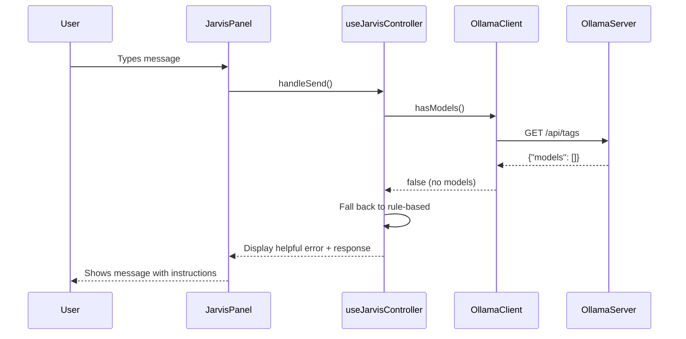
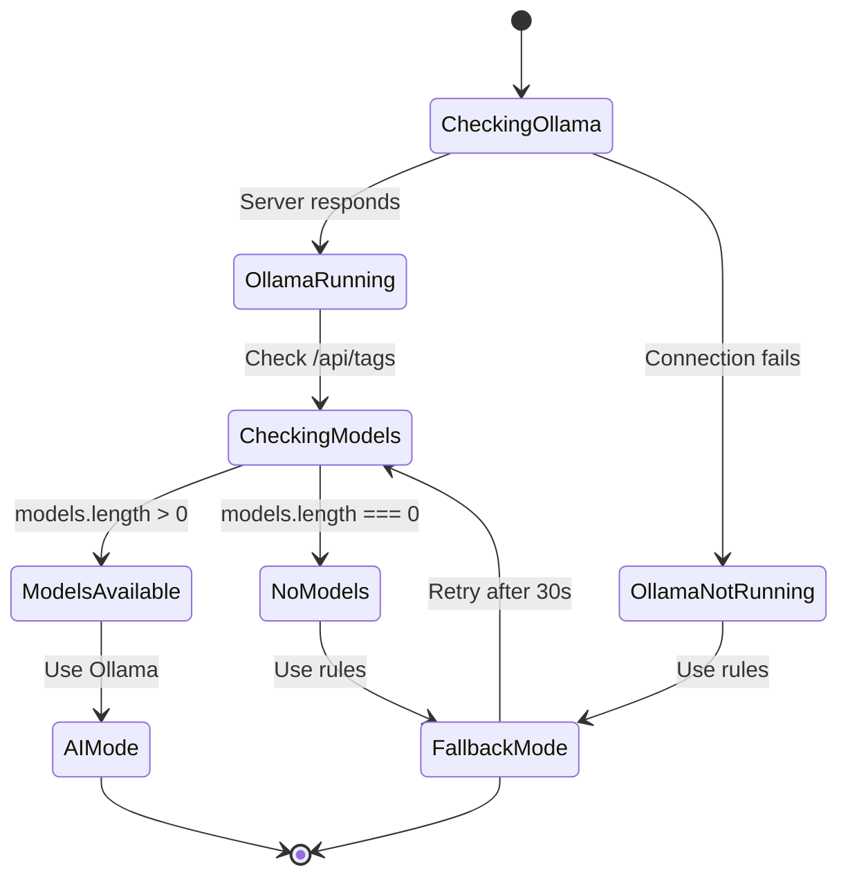
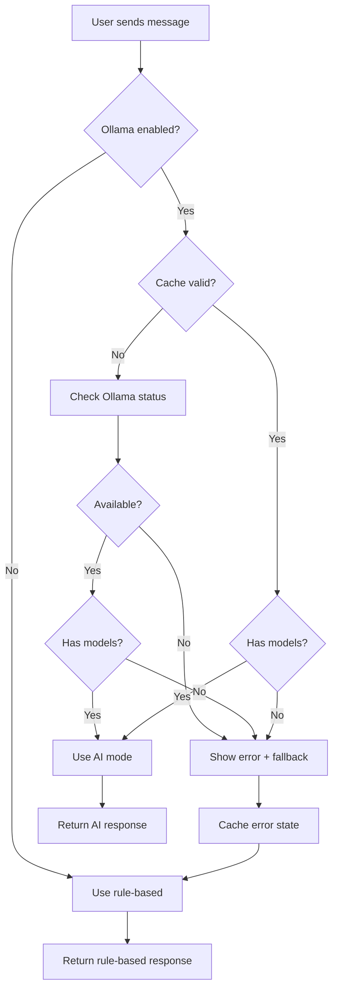

# Design Document: Ollama Error Handling Enhancement

## Overview

This design enhances the Ollama integration in Arc Browser's Jarvis assistant to gracefully handle scenarios where Ollama is running but no models are installed. The current implementation throws generic 404 errors that confuse users. This enhancement will detect missing models, provide clear error messages, automatically fall back to rule-based responses, and recover seamlessly when models are installed.

## Architecture

### Component Interaction



### Error State Machine



## Components and Interfaces

### 1. Enhanced OllamaClient

**File:** `src/core/ollamaClient.ts`

**New Methods:**

```typescript
export enum OllamaErrorType {
  SERVER_NOT_RUNNING = 'SERVER_NOT_RUNNING',
  NO_MODELS_INSTALLED = 'NO_MODELS_INSTALLED',
  MODEL_NOT_FOUND = 'MODEL_NOT_FOUND',
  TIMEOUT = 'TIMEOUT',
  UNKNOWN = 'UNKNOWN'
}

export class OllamaError extends Error {
  constructor(
    message: string,
    public type: OllamaErrorType,
    public details?: any
  ) {
    super(message);
    this.name = 'OllamaError';
  }
}

export class OllamaClient {
  // ... existing methods ...
  
  /**
   * Check if Ollama has any models installed
   */
  async hasModels(): Promise<boolean> {
    try {
      const models = await this.listModels();
      return models.length > 0;
    } catch (error) {
      return false;
    }
  }
  
  /**
   * Get detailed Ollama status
   */
  async getStatus(): Promise<{
    available: boolean;
    hasModels: boolean;
    models: OllamaModel[];
    error?: OllamaError;
  }> {
    const available = await this.isAvailable();
    
    if (!available) {
      return {
        available: false,
        hasModels: false,
        models: [],
        error: new OllamaError(
          'Ollama server is not running',
          OllamaErrorType.SERVER_NOT_RUNNING
        )
      };
    }
    
    try {
      const models = await this.listModels();
      const hasModels = models.length > 0;
      
      if (!hasModels) {
        return {
          available: true,
          hasModels: false,
          models: [],
          error: new OllamaError(
            'No models installed in Ollama',
            OllamaErrorType.NO_MODELS_INSTALLED
          )
        };
      }
      
      return {
        available: true,
        hasModels: true,
        models
      };
    } catch (error) {
      return {
        available: true,
        hasModels: false,
        models: [],
        error: new OllamaError(
          'Failed to check models',
          OllamaErrorType.UNKNOWN,
          error
        )
      };
    }
  }
  
  /**
   * Enhanced chat with better error handling
   */
  async chat(request: OllamaChatRequest): Promise<string> {
    try {
      // Check if models are available first
      const hasModels = await this.hasModels();
      if (!hasModels) {
        throw new OllamaError(
          'No models installed. Install a model with: ollama pull llama3',
          OllamaErrorType.NO_MODELS_INSTALLED
        );
      }
      
      const controller = new AbortController();
      const timeoutId = setTimeout(() => controller.abort(), this.timeout);

      const response = await fetch(`${this.baseUrl}/api/chat`, {
        method: 'POST',
        headers: {
          'Content-Type': 'application/json',
        },
        body: JSON.stringify({
          ...request,
          stream: false,
        }),
        signal: controller.signal,
      });

      clearTimeout(timeoutId);

      if (!response.ok) {
        // Handle 404 specifically
        if (response.status === 404) {
          throw new OllamaError(
            `Model '${request.model}' not found. Check installed models with: ollama list`,
            OllamaErrorType.MODEL_NOT_FOUND
          );
        }
        throw new OllamaError(
          `Ollama chat failed: ${response.statusText}`,
          OllamaErrorType.UNKNOWN
        );
      }

      const data: OllamaChatResponse = await response.json();
      return data.message.content;
    } catch (error) {
      if (error instanceof OllamaError) {
        throw error;
      }
      if (error.name === 'AbortError') {
        throw new OllamaError(
          'Request timed out',
          OllamaErrorType.TIMEOUT
        );
      }
      console.error('Error chatting with Ollama:', error);
      throw new OllamaError(
        'Failed to communicate with Ollama',
        OllamaErrorType.UNKNOWN,
        error
      );
    }
  }
}
```

### 2. Enhanced useJarvisController Hook

**File:** `src/renderer/hooks/useJarvisController.ts`

**New State:**

```typescript
interface OllamaState {
  available: boolean;
  hasModels: boolean;
  lastChecked: number;
  cacheTimeout: number; // 30 seconds
}

const [ollamaState, setOllamaState] = useState<OllamaState>({
  available: false,
  hasModels: false,
  lastChecked: 0,
  cacheTimeout: 30000
});
```

**Enhanced getOllamaReply:**

```typescript
async function getOllamaReply(
  text: string,
  recommendations: Recommendation[],
  ollamaState: OllamaState,
  setOllamaState: (state: OllamaState) => void
): Promise<{ text: string; shouldFallback: boolean }> {
  try {
    console.log('🔌 Connecting to Ollama...');
    const ollamaClient = getOllamaClient();
    
    // Check cache first
    const now = Date.now();
    const cacheValid = (now - ollamaState.lastChecked) < ollamaState.cacheTimeout;
    
    if (!cacheValid || !ollamaState.available) {
      console.log('🔍 Checking Ollama status...');
      const status = await ollamaClient.getStatus();
      
      setOllamaState({
        available: status.available,
        hasModels: status.hasModels,
        lastChecked: now,
        cacheTimeout: 30000
      });
      
      if (!status.available) {
        console.log('⚠️ Ollama server is not running');
        return {
          text: 'Ollama is not running. Start it with: ollama serve',
          shouldFallback: true
        };
      }
      
      if (!status.hasModels) {
        console.log('⚠️ Ollama has no models installed');
        return {
          text: 'Ollama has no models installed. Install one with: ollama pull llama3\n\nFalling back to basic responses for now.',
          shouldFallback: true
        };
      }
      
      console.log('✅ Ollama is ready with', status.models.length, 'models');
    }

    // Get recent history for context
    let recentHistory: Array<{ url: string; title: string }> = [];
    if (window.arc && window.arc.getRecentHistory) {
      const history = await window.arc.getRecentHistory(5);
      recentHistory = history.map(h => ({
        url: h.url,
        title: h.title || h.url,
      }));
      console.log('📚 Recent history loaded:', recentHistory.length, 'items');
    }

    // Prepare recommendations context
    const recsContext = recommendations.slice(0, 3).map(r => ({
      url: r.url,
      title: r.title || r.url,
      reason: r.reason,
    }));
    console.log('💡 Recommendations context:', recsContext.length, 'items');

    // Chat with Ollama
    console.log('💬 Sending to Ollama:', text);
    const response = await ollamaClient.chatWithJarvis(text, {
      recentHistory,
      recommendations: recsContext,
    });
    console.log('✅ Ollama response received:', response.length, 'characters');

    return { text: response, shouldFallback: false };
  } catch (error) {
    console.error('❌ Error getting Ollama reply:', error);
    
    if (error instanceof OllamaError) {
      if (error.type === OllamaErrorType.NO_MODELS_INSTALLED) {
        return {
          text: 'Ollama has no models installed. Install one with:\n\nollama pull llama3\n\nFalling back to basic responses for now.',
          shouldFallback: true
        };
      }
      if (error.type === OllamaErrorType.MODEL_NOT_FOUND) {
        return {
          text: 'The selected model is not installed. Check available models with:\n\nollama list\n\nFalling back to basic responses for now.',
          shouldFallback: true
        };
      }
    }
    
    return {
      text: 'Sorry, I encountered an error connecting to Ollama. Falling back to basic responses.',
      shouldFallback: true
    };
  }
}
```

**Enhanced handleSend:**

```typescript
const handleSend = async () => {
  if (!input.trim()) return;

  const userText = input.trim();
  setMessages(prev => [...prev, { from: 'user', text: userText }]);
  setInput('');
  
  // Reset textarea height
  const textarea = document.querySelector('.jarvis-panel textarea') as HTMLTextAreaElement;
  if (textarea) {
    textarea.style.height = 'auto';
  }

  setStatus('thinking');

  // Check if Ollama is enabled
  console.log('💬 User message:', userText);
  const ollamaEnabled = await isOllamaEnabled();
  console.log('🤖 Ollama enabled:', ollamaEnabled);

  try {
    if (ollamaEnabled) {
      console.log('✨ Using Ollama for AI response...');
      
      const result = await getOllamaReply(userText, recommendations, ollamaState, setOllamaState);
      
      if (result.shouldFallback) {
        // Show error message first
        setMessages(prev => [...prev, { from: 'jarvis', text: result.text }]);
        
        // Then provide fallback response
        setTimeout(async () => {
          const fallbackReply = await getJarvisReply(userText);
          setMessages(prev => [...prev, { from: 'jarvis', text: fallbackReply.text }]);
          
          if (fallbackReply.action === 'refresh') {
            fetchRecommendations();
          } else {
            setStatus('idle');
          }
        }, 500);
      } else {
        setMessages(prev => [...prev, { from: 'jarvis', text: result.text }]);
        setStatus('idle');
      }
    } else {
      console.log('📝 Using rule-based response (Ollama disabled)...');
      setTimeout(async () => {
        const reply = await getJarvisReply(userText);
        console.log('✅ Rule-based response:', reply.text);
        setMessages(prev => [...prev, { from: 'jarvis', text: reply.text }]);

        if (reply.action === 'refresh') {
          fetchRecommendations();
        } else {
          setStatus('idle');
        }
      }, 600);
    }
  } catch (error) {
    console.error('❌ Error getting Jarvis response:', error);
    setMessages(prev => [...prev, { 
      from: 'jarvis', 
      text: 'Sorry, I encountered an unexpected error. Please try again.' 
    }]);
    setStatus('error');
  }
};
```

### 3. Enhanced Settings UI

**File:** `src/renderer/components/SettingsPanel.tsx`

**Model Dropdown Enhancement:**

```typescript
const [ollamaStatus, setOllamaStatus] = useState<{
  available: boolean;
  hasModels: boolean;
  models: string[];
  loading: boolean;
}>({
  available: false,
  hasModels: false,
  models: [],
  loading: true
});

useEffect(() => {
  const checkOllamaStatus = async () => {
    try {
      const client = getOllamaClient();
      const status = await client.getStatus();
      
      setOllamaStatus({
        available: status.available,
        hasModels: status.hasModels,
        models: status.models.map(m => m.name),
        loading: false
      });
    } catch (error) {
      console.error('Failed to check Ollama status:', error);
      setOllamaStatus({
        available: false,
        hasModels: false,
        models: [],
        loading: false
      });
    }
  };
  
  if (settings.ollamaEnabled) {
    checkOllamaStatus();
  }
}, [settings.ollamaEnabled]);

// In the render:
<div className="setting-item">
  <label>Ollama Model</label>
  {!ollamaStatus.available && (
    <div className="ollama-warning">
      ⚠️ Ollama is not running. Start it with: <code>ollama serve</code>
    </div>
  )}
  {ollamaStatus.available && !ollamaStatus.hasModels && (
    <div className="ollama-warning">
      ⚠️ No models installed. Install one with: <code>ollama pull llama3</code>
    </div>
  )}
  <select
    value={settings.ollamaModel}
    onChange={(e) => handleSettingChange('ollamaModel', e.target.value)}
    disabled={!ollamaStatus.hasModels}
  >
    {ollamaStatus.hasModels ? (
      ollamaStatus.models.map(model => (
        <option key={model} value={model}>{model}</option>
      ))
    ) : (
      <option value="">No models available</option>
    )}
  </select>
</div>
```

## Data Models

### OllamaError

```typescript
export enum OllamaErrorType {
  SERVER_NOT_RUNNING = 'SERVER_NOT_RUNNING',
  NO_MODELS_INSTALLED = 'NO_MODELS_INSTALLED',
  MODEL_NOT_FOUND = 'MODEL_NOT_FOUND',
  TIMEOUT = 'TIMEOUT',
  UNKNOWN = 'UNKNOWN'
}

export class OllamaError extends Error {
  constructor(
    message: string,
    public type: OllamaErrorType,
    public details?: any
  ) {
    super(message);
    this.name = 'OllamaError';
  }
}
```

### OllamaStatus

```typescript
interface OllamaStatus {
  available: boolean;      // Is Ollama server running?
  hasModels: boolean;      // Are any models installed?
  models: OllamaModel[];   // List of installed models
  error?: OllamaError;     // Error if any
}
```

### OllamaState (Hook State)

```typescript
interface OllamaState {
  available: boolean;      // Cached: Is Ollama running?
  hasModels: boolean;      // Cached: Are models installed?
  lastChecked: number;     // Timestamp of last check
  cacheTimeout: number;    // Cache duration (30s)
}
```

## Correctness Properties

*A property is a characteristic or behavior that should hold true across all valid executions of a system—essentially, a formal statement about what the system should do. Properties serve as the bridge between human-readable specifications and machine-verifiable correctness guarantees.*

### Property 1: Error Type Accuracy

*For any* Ollama error condition, the system should return the correct `OllamaErrorType` that matches the actual failure mode.

**Validates: Requirements 1.3, 1.4**

### Property 2: Fallback Consistency

*For any* user message when Ollama is unavailable or has no models, the system should always provide a rule-based response within 1 second.

**Validates: Requirements 3.1, 3.5**

### Property 3: Cache Invalidation

*For any* cached Ollama state older than 30 seconds, the system should re-check Ollama status on the next user message.

**Validates: Requirements 6.3, 6.4**

### Property 4: Model Detection Accuracy

*For any* call to `hasModels()`, the return value should match whether the `/api/tags` endpoint returns a non-empty models array.

**Validates: Requirements 4.1, 4.3, 4.4**

### Property 5: Error Message Clarity

*For any* Ollama error displayed to the user, the message should include actionable instructions (commands to run).

**Validates: Requirements 2.2, 2.3, 2.4**

### Property 6: State Recovery

*For any* transition from "no models" to "models available", the system should detect this within 30 seconds and switch to AI mode.

**Validates: Requirements 6.2, 8.2**

### Property 7: No Repeated Checks

*For any* sequence of user messages within 30 seconds, the system should check Ollama status at most once.

**Validates: Requirements 3.4**

## Error Handling

### Error Categories

1. **SERVER_NOT_RUNNING**: Ollama server is not accessible
   - User message: "Ollama is not running. Start it with: ollama serve"
   - Action: Fall back to rule-based responses
   - Retry: On next message after cache expires

2. **NO_MODELS_INSTALLED**: Ollama is running but has no models
   - User message: "Ollama has no models installed. Install one with: ollama pull llama3"
   - Action: Fall back to rule-based responses
   - Retry: On next message after cache expires

3. **MODEL_NOT_FOUND**: Specific model requested doesn't exist
   - User message: "The selected model is not installed. Check available models with: ollama list"
   - Action: Fall back to rule-based responses
   - Suggestion: Update settings to use an installed model

4. **TIMEOUT**: Request took longer than 30 seconds
   - User message: "Request timed out. Ollama might be busy or the model is too large."
   - Action: Fall back to rule-based responses
   - Suggestion: Try a smaller/faster model

5. **UNKNOWN**: Unexpected error
   - User message: "Sorry, I encountered an unexpected error. Please try again."
   - Action: Fall back to rule-based responses
   - Logging: Full error details logged to console

### Error Recovery Strategy



## Testing Strategy

### Unit Tests

1. **OllamaClient.hasModels()**
   - Test with empty model list returns false
   - Test with non-empty model list returns true
   - Test with connection error returns false

2. **OllamaClient.getStatus()**
   - Test when server not running
   - Test when server running but no models
   - Test when server running with models
   - Test error handling

3. **OllamaError creation**
   - Test each error type creates correct instance
   - Test error message formatting
   - Test error details preservation

4. **useJarvisController state management**
   - Test cache expiration logic
   - Test state updates on status changes
   - Test fallback triggering

### Property-Based Tests

1. **Property 1: Error Type Accuracy**
   - Generate random error conditions
   - Verify correct OllamaErrorType returned
   - **Validates: Requirements 1.3, 1.4**

2. **Property 2: Fallback Consistency**
   - Generate random user messages
   - Simulate Ollama unavailable
   - Verify fallback response within 1s
   - **Validates: Requirements 3.1, 3.5**

3. **Property 4: Model Detection Accuracy**
   - Generate random model lists (empty and non-empty)
   - Verify `hasModels()` matches list.length > 0
   - **Validates: Requirements 4.1, 4.3, 4.4**

4. **Property 7: No Repeated Checks**
   - Generate sequence of messages within 30s
   - Verify status checked only once
   - **Validates: Requirements 3.4**

### Integration Tests

1. **End-to-end error flow**
   - Start with Ollama not running
   - Send message, verify fallback
   - Start Ollama (no models)
   - Send message, verify error + fallback
   - Install model
   - Send message, verify AI response

2. **Settings UI integration**
   - Test model dropdown with no models
   - Test model dropdown with models
   - Test warning messages display

### Manual Testing

1. **User Experience Flow**
   - Enable Ollama without models installed
   - Verify clear error messages
   - Install a model
   - Verify automatic recovery
   - Verify AI responses work

## Performance Considerations

- **Cache Duration**: 30 seconds balances responsiveness with API call overhead
- **Timeout**: 30 seconds for Ollama requests prevents hanging
- **Status Check**: 2 seconds timeout for availability checks
- **Fallback Speed**: <1 second for rule-based responses

## Security Considerations

- All Ollama communication is local (localhost:11434)
- No sensitive data sent to external services
- Error messages don't expose system internals
- Graceful degradation maintains functionality

## Future Enhancements

1. **Auto-install models**: Prompt user to install models from UI
2. **Model recommendations**: Suggest best models for user's hardware
3. **Streaming responses**: Show AI text as it's generated
4. **Conversation memory**: Remember previous messages in session
5. **Custom error messages**: Allow users to customize error text
